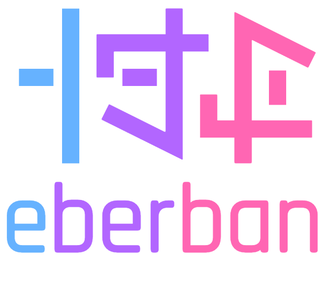

  

eberban
=========

**eberban** is a [Lojban](https://mw.lojban.org/papri/Lojban)-inspired
[constructed language](https://en.wikipedia.org/wiki/Constructed_language) aimed
at being simple, regular and expressive.

- Simple: eberban is made entirely out of predicates, which are manipulated with
  particles, following relatively few yet composable grammar rules.
- Regular: particles are organized into families, each with a unique prefix,
  enabling quick recognition and accelerating learning.
- Expressive: predicates can be combined and transformed in a variety of ways,
  greatly increasing the expressive power of the language.

For more resources about the language, please visit this repository's [GitHub
pages](https://mia-entropy.github.io/eberban/). Among others, you will find a
[reference
grammar](https://mia-entropy.github.io/eberban/books/reference_en/book/) (WIP at
the moment), a [visual
parser](https://mia-entropy.github.io/eberban/web/parser_box_glosser.html)
and a succint illustration of our [custom writing
system](https://mia-entropy.github.io/eberban/images/writing_system.svg). If you
would like to get involved, please also consider joining our [Discord
server](https://discord.com/invite/KKB79RwWUc).