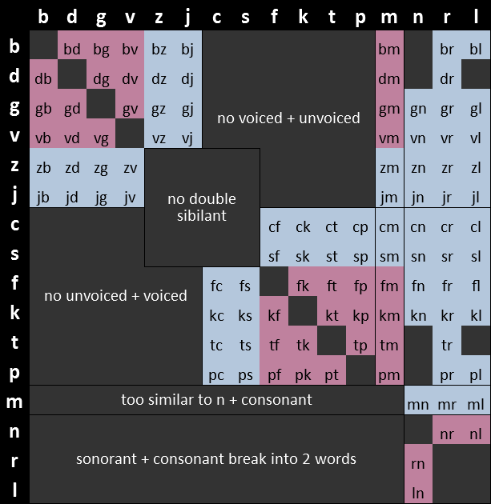

# Morphology

The morphology of Eberban is composed of 16 consonants (__n, r, l, m, p, b, f,
v, t, d, s, z, c, j, g, k__), five vowels (__i, e, a, o, u__) and finally the
letters __h__ and __'__, for a total of 23 letters. Among the consonants, __n__,
__r__ and __l__ are designated as (alveolar) __sonorants__, and play an
important role in Eberban's morphology. The alphabetical order is
`hnrlmpbfvtdszcjkgieaou'`. The same letter appearing multiple times in a row is
considered identical to the letter not being repeated, but can informally be
used in written media to convey length of sounds in speech.

Words are usually written separated by spaces, however this is not mandatory.
While removing spaces, however, it might be required to add the __word boundary
marker__ symbol __'__ in some places. More than one marker in a row is not
allowed. Letters are chained one after the other without spaces to form
__words__ which are divided into multiple categories based on their structure.

Eberban text is usually written all lowercase (outside of foreign text quotes),
but uppercase can informally be used in written media to convey volume (such as
yelling). Outside of __'__ no punctuation symbol is used, and any other
character is considered a space, but informally punctuation from other languages
can be used (for example by writing `"` around quotes, or ending sentences with
`.`).

## Word types

### Particles

__Particles__ are words exerting grammatical functions. They start with a single
_non-sonorant consonant_, followed only by _vowels_ and _h_, like __pa__,
__mio__ or __tiho__. Particles are themselves categorized into __families__
having identical grammar but different meanings. Those families are usually
designated using a particle in capital letters (like __MI__ or __VEI__), which
is by convention the first particle in this family in alphabetical order.

All other words are __predicate words__ and express intrinsic meanings, such as
"cat", "language" or "teach". They are grouped into the following categories :

### Roots

__Roots__ are the building blocks of the language and express meanings that
would be hard or too long to convey otherwise. They can either :

- start with a single _non-sonorant consonant_ followed by a mix of _vowels_ and
  at least one _sonorant_ or _medial consonant pair_, like __ban__, __mana__,
  __cuina__ or __marne__.
- start with a valid _initial consonant pair_ followed by a mix of _vowels_ and
  any number of _sonorants_ or _medial consonant pairs_ (even none), like
  __bju__, __cpena__ or __djin__.

A _sonorant_ can appear only between two _vowels_ or at the end of the root, while
a medial pair can appear only between two _vowels_, but not at the end.

The following chart shows __initial pairs__ in light blue, __medial pairs__ in
pink, and invalid pairs in dark gray (with a short explanation for why they are
invalid):

### Borrowings

__Borrowings__ allow importing of foreign words or names. They are prefixed by 
the vowel __u__, and have more relaxed rules about consonants than native 
Eberban words. Mainly, they can contain consonant triplets which must obey the 
following rules: 

 - Consonant pairs must either be _initial pairs_, _medial pairs_ or _sonorant_
   + _consonant_.
 - Consonant triplets C1C2C3 are valid if C1C2 is a medial pair __and__ C2C3 is
   an initial pair.
 - Alternatively, consonant triplets can be a _sonorant_ followed by an _initial
   pair_.

After the __u__  prefix the borrowing can start by a vowel, a single consonant,
a initial or medial consonant pair, a consonant triplet or __h__ If this first
letter is a __u__ it must be prefixed with a __'__ to separate it from the the
prefix.

Borrowings must end with a _vowel_, or a _vowel_ followed by a single
_consonant_ (not only _sonorants_). In written media, borrowings must be
followed by either spaces or a word boundary marker, which is realized in speech
by pausing after the borrowing to properly separate it from the following word.

Similarly, the initial __u__ must be either preceded by spaces or a word
boundary marker, and realized orally as either a pause or a glottal stop.

### Freeform variables

__Freeform variables__ allow defining predicates with a custom name. They
follow the same morphology as _borrowings_ but use the __i__ prefix instead of
__u__.

### Compounds

__Compounds__ allow making new words from multiple other kind of words.
They start with either __e__, __a__ or __o__ and follow the same rule as the
__u__ of borrowings. Their structure will be detailed later in this book.

### Example

With spaces : _pa za umia tsen eberban_  
Without spaces : _paza'umia'tsen'eberban_

Particles : _pa_, _za_  
Borrowing : _umia_  
Freeform variable: _ibar_  
Root : _tsen_  
Compound : _eberban_

### Reasoning

Outside of borrowings and assignable names, encountering a _non-sonorant
consonant_ or a word boundary marker means it is the start of a new word; unless
it the first letter of a _medial consonant pair_ which cannot be misunderstood
for the start of a new word. Word boundary markers or spaces prevent words from
"merging" into adjacent words.

These simple rules prevent any ambiguity of word boundaries, which is called a
__Self-Segregating Morphology__.
