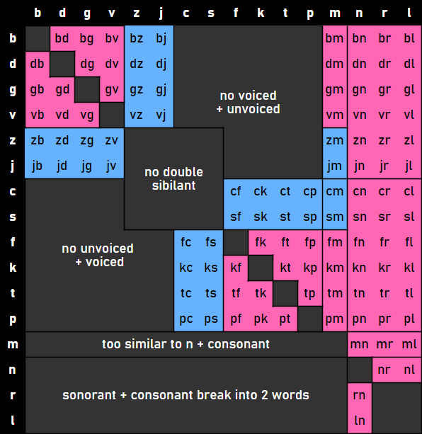

# Morphology

The morphology of Eberban is composed of 16 consonants (__n, r, l, m, p, b, f, v, t, d, s, z, c, j,
g, k__), five vowels (__i, e, a, o, u__) the letter __h__, the hyphen __-__ and the quotation marks
__[__ and __]__, for a total of 25 symbols. Among the consonants, __n__, __r__ and __l__ are
designated as (alveolar) __sonorants__, and play an important role in Eberban's morphology. The
alphabetical order is `hnrlmpbfvtdszcjkgieaou`. The same letter appearing multiple times in a row is
considered identical to the letter not being repeated, but can informally be used in written media
to convey length of sounds in speech. Any other character is considered a space, and quotation marks
are also considered a space outside of foreign quotes syntax (explained later).

Strings of multiple vowels and __h__ appear a lot in Eberban's morphology, and thus are coined
__vhowels__ in this book. Note that in __vhowels__, __h__ can only appear between two vowels.

Words are usually written separated by spaces, however this is not mandatory. Spaces are only
mandatory before words starting with a __vowel__ or a __sonorant__.

Eberban text is usually written all lowercase (outside of foreign text quotes), but uppercase can
informally be used in written media to convey volume (such as yelling). No punctuation symbol is
used but informally punctuation from other languages can be used as long as the proper Eberban
grammar is also used. `.` is commonly used to visually join two words that must have space between
them, while one or many `.` surrounded by spaces usually convey a longer pause in speach. Hyphen can
be used at syllable boundary to make them stand-out without breaking the word in two, and also allows
a word to continue on the next line.

## Word types

### Particles

__Particles__ are words exerting grammatical functions. They can either:
- start with a single _non-sonorant consonant_, followed only by _vhowels_, like __zi__,
  __mio__ or __tiho__.
- start with a _sonorant_ or _vowels_, and be a string of _vhowels_ and _sonorants_. They can end
  either with a _vowel_ or _sonorant_. Exemples: __a__, __on__, __ahu__ or __nu__.

Particles are themselves categorized into __families__ having identical grammar
but different meanings. Those families are usually designated using a particle in capital letters
(like __MI__ or __VEI__), which is by convention the first particle in this family in alphabetical
order.

All other words are __predicate words__ and express intrinsic meanings, such as "cat", "language" or
"teach". They are grouped into the following categories :

### Roots

__Roots__ are the building blocks of the language and express meanings that would be hard or too
long to convey otherwise. They can either:

- start with a single _non-sonorant consonant_ followed by a mix of _vhowels_ and at least one
  _sonorant_, _medial consonant pair_ or _consonant triplet_, like __ban__, __mana__, __cuina__ or
  __marne__.
- start with a valid _initial consonant pair_ followed by a mix of _vhowels_ and any number of
  _sonorants_, _medial consonant pairs_  or _consonant triplet_ (even none), like __bju__, __cpena__
  or __djin__.

A _consonant triplet_ is a string of 3 consonants C1C2C3 such that C1C2 is a medial pair __and__
C2C3 is either an initial pair or a consonant-sonorant medial pair (e.g. __kl__, __tr__, __pn__).

A _sonorant_ can appear only between two _vowels_ or at the end of the root, while a medial pair or
consonant triplet can appear only between two _vowels_, but not at the end.

#### Which pairs are valid

For the pair rules, consonants fall into these overlapping groups:

- __Sibilants__: __c s j z__.
- __Plosives__: __p b t d k g__.
- __Fricatives__: __f v__ (plus the sibilants).
- __Sonorants__: __n r l__.
- __Voicing__: __b d g v z j__ are voiced, __p t k f s c__ are unvoiced; __m n r l__ have no voicing distinction.

Some constraints apply to every pair XY, regardless of position:

1. X and Y must differ (a doubled letter is spelling for length, not a pair).
2. If both X and Y carry voicing, they must agree; no voiced + unvoiced or unvoiced + voiced.
3. Two sibilants never form a pair.
4. A sonorant followed by a non-sonorant is never a pair; the boundary breaks the string into two words.
5. __m__ followed by a non-sonorant (other than a sibilant) is disallowed, being too close to __n__ + consonant.

__Initial pairs__ must contain a sibilant, and the second consonant must not be a sonorant. They come in two shapes:

- __Non-sibilant obstruent + sibilant__, voicing matched.
  Voiced: __bj bz dj dz gj gz vj vz__. Unvoiced: __fc fs kc ks pc ps tc ts__.
- __Sibilant + non-sonorant__ (a plosive, __f v__, or __m__), voicing matched (__m__ is neutral).
  Sibilant voiced first: __jb jd jg jv jm zb zd zg zv zm__. Sibilant unvoiced first: __cf ck cp ct cm sf sk sp st sm__.

__Medial pairs__ are every other valid pair. They come in three shapes:

- __Two obstruents of matching voicing__, optionally ending in __m__.
  Voiced: __bd bg bv db dg dv gb gd gv vb vd vg__, plus __bm dm gm vm__.
  Unvoiced: __fk fp ft kf kp kt pf pk pt tf tk tp__, plus __fm km pm tm__.
- __Non-sonorant + sonorant__: any consonant except a sonorant, followed by __n__, __r__, or __l__.
  This gives __bl br bn cl cr cn dl dr dn fl fr fn gl gr gn jl jr jn kl kr kn ml mr mn pl pr pn sl sr sn tl tr tn vl vr vn zl zr zn__.
- __n paired with a liquid__: __nl nr ln rn__.

The following chart shows __initial pairs__ in light blue, __medial pairs__ in pink, and invalid pairs in dark gray (with a short explanation for why they are invalid):

### Borrowings

__Borrowings__ allow importing foreign words or names. They are prefixed by the vowel __u__, and
have more relaxed rules about consonants than native Eberban words: 

 - _Initial pairs_ can also appear in the middle of the word.
 - _Medial pairs_ can also appear initially as they can be easily uttered after borrowing prefix
   __u__
 - _Sonorant_ + _consonant_ also counts as a consonant pair and doesn't break into 2 words.
 - _Sonorant_ + _initial pair_ also counts as a consonant triplet and doesn't break into 2 words.

After the __u__  prefix the borrowing can start by a vowel, a single consonant, a initial or medial
consonant pair, a consonant triplet or __h__. If this first letter is a __u__ it must be prefixed
with a __'__ to separate it from the the prefix.

Borrowings must end with a _vowel_, or a _vowel_ followed by a single _consonant_ (not only
_sonorants_). In written media, borrowings must be followed by space(s), which is realized in speech
by pausing after the borrowing to properly separate it from the following word.

Similarly, the initial __u__ must be preceded by space(s), and realized orally as either a pause or
a glottal stop.

### Freeform variables

__Freeform variables__ allow speakers to define their own predicates with less morphological
restrictions than with roots or dedicated particles. They follow the same morphology as _borrowings_
but use the __i__ prefix instead of __u__.

### Compounds

__Compounds__ allow making new words from multiple other kind of words. They start with either
__e__, __en__ or __er__ and follow the same rule as the __u__ of borrowings. Their structure will be
detailed [later in this book](../grammar/compounds.md).

### Example

With spaces : _a za ualis zue gali spie ebansa eberban_\
With mandatory spaces only : _aza.ualis.zuegalispie.ebansa.eberban_\
Meaning: Alice is happy to speak in Eberban.

Particles : _a_, _za_, _zue_\
Borrowing : _ualis_\
Freeform variable: _ibar_ (not present in exemple)\
Root : _gali_, _spie_\
Compounds : _ebansa_, _eberban_

### Reasoning

Outside of borrowings and assignable names, encountering a _non-sonorant consonant_ or a pause means
it is the end of a word; unless it the first letter of a _medial consonant pair_ which cannot be
misunderstood for the start of a new word. Spaces prevent words starting with a _vowel_ or
_sonorant_ to "merge" into the previous words.

These simple rules prevent any ambiguity of word boundaries, which is called a __Self-Segregating
Morphology__.
