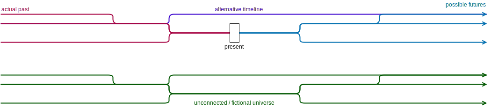

# Event and tenses

## What is the general design of Eberban's time system?

Time is represented using a graph of instants. It supports multiple possible futures and pasts,
parallel and fictional universes. The context variable caries time-related information to time-aware
predicates that handles time for you behind the scene.

Physical entities (*pan*) are associated with the space-time volume (*skan*) they occupy, as the
spatial volume they occupy at each instant they exist (possibly along multiple timelines).

## Common timespan

Each use of *pan* interacts with a time interval (formed by a start and end instant, and a specific
path connecting them) stored in the context called the **common timespan**. Each *pan* states that
the physical entity exists during the **common timespan** (it may exist outside of it), and words
describing an action like *etiansa* (eat) states that the **common timespan** is contained during
the timespan of the action. The **common timespan** is thus the intersection of all the time spans
of all involved physical entities and actions.

This **common timespan** is placed in the context by *ski* and time relations words, which constrain
it to be maximal (given some timespan *x*, there doesn't exist another timespan *y* that contains
*x* which makes the proposition true; this timespan *y* is not contained by one or many timespans of
involved physical entities or actions).

This design allows to easily express events involving many entities and actions. The sentence "In
this room there is an cat, and you eating an apple" expresses the presence of the cat while you're
eating an apple. The existence of the cat, you, the apple and the action of eating all contains the
**common timespan** (and they can unfold outside of it).

## Time anchor

The time anchor is a timespan that is automatically stated to be contained by the **sentence common
timespan**, and which is usually the **present**.

The current time anchor can be refered to using *skun*, and *en an skun sai* can be used in a *an*
sentence to change the time anchor for future sentences.

The real world present can be refered to using *sufkun*, which is updated between each sentence to
"move forward in time".

## Time relations

Time relations relates an **inner proposition** (it's A slot) with a reference event (E slot), which
by default is the **outer proposition** current event.

- *sre*: A **is before** E: end of A is before the start of E
- *sra*: A **starts** E: start of A is start of E
- *sro*: A **finishes** E: end of A is end of E
- *sru*: A **is after** E: start of A is after the end of E
- *srui*: A **contains** E
- *srei*: A **is contained by** E
- *srai*: A **intersects with** E
- *sri*: A **is unconstrained by** E (but still reachable from E).

*sre* (before) and *sru* (after) have an O slot for the duration separating the 2 timespans. As
giving a precise duration may be difficult or too precise, compounds with time units are made to
give a vague time scale of such duration :

- *e ti sre/sru*: very short time for common speech, less than 1 second (excluded)
- *e vola sre/sru*: few seconds, between 1 second (included) and 1 minute (excluded)
- *e jero sre/sru*: few minutes, between 1 minute (included) and 1 hour (excluded)
- *e sura sre/sru*: few hours, between 1 hour (included) and 1 day (excluded)
- *e dena sre/sru*: few days, between 1 day (included) and 1 week (excluded)
- *e kora sre/sru*: few weeks, between 1 week (included) and 1 month (excluded)
- *e gare sre/sru*: few months, between 1 month (included) and 1 year (excluded)
- *e bire sre/sru*: more than 1 year (included)

## How are events modeled?

An event (*ski*) is modeled as an object containing the following information:
- The proposition describing the event
- The set of all physical entities involved in the proposition, each with their associated
  space-time volume
- Possibly other informations, this will be figured out with usage.

## Event words

*ski* allows to related an event (E slot) with its defining propositon (A slot). It evaluates this
proposition with its own **inner common timespan**, and doesn't relate it with another event. "I
like the event of [you dance]" doesn't means that the "liking" and the "dancing" occurs at the same
time. Inside a *ski* or in a sentence, *skul* can be used to refer to the current event.

*skun* allows to state that a given event (E slot) is occuring in the **outer common timespan** with
the exact same set of physical entities it was defined with. "That (dancing) occured before lunch"
speaks about the same event (the one where you dance and that I liked).

## Modal logic

Something is **necessary** if it occurs in all timelines containing the
**common timespan**, while something is **possible** if it occurs in at least
one timeline. Sentences states that their content is necessary, but it can
be expressed explicitly using:

- *sni*: A is possible
- *snu*: A is necessary
  
## Counterfactual conditionals

[Counterfactual conditionals] can be expressed using *sna* which have meaning
"A would be true if E was true." It implies that: 

- both E and A are false in the current timeline
- at any instant I in the past of the current timeline, if E occurs in the future of I, then
  A necessarily occurs too.
- as A is evaluated in the current timeline with some common timespan T , it is evaluated in
  the other timelines with a timespan T2 such that T and T2 have the same duration, and their
  distance with I is the same.  

[Counterfactual conditionals]: https://en.wikipedia.org/wiki/Counterfactual_conditional

## Space relations

TODO