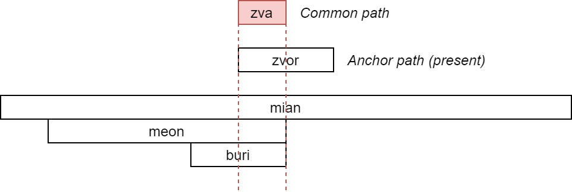

# Time

> __DRAFT__: This chapter is being worked on and is not finished, and the
> vocabulary and design will likely change in the future.

Design a tense system that is easy to use at high level, but that is defined in
Eberban at low level is a major chalenge, and is the reason for the existence of
some parts of the grammar (even if those parts are more general purposed and
don't depend on the tense system).

## Model of time

First, we want to model the passage of time and the differents states in which
the universe are alongside it. We also want a model that allows us to deal with
multiple possible futures or even parallel or fictional universes.

To do that we'll first define a __node__ in a __directed graph__ (also called
__digraph__), with (directed) __arcs__ representing a transition from a node to
another. We'll define a node as a pair of an identifier (`zai din`) and set of
nodes that this node have arcs towards. Note that while sets can't be empty, we
want to support nodes with no arcs, which is done by using a sentinel value
instead of the set (`zai din` again).

> din: `[E:ma]` is a digraph node.
>
> ```
> po din ke be
> ke kin
>   va zai din
>   fo vare
>     ve zai din
>     fa tce din
> ```

We can then define predicates to more easily speak about arcs and paths
(transitive arcs).

> dini: There exist an arc from node `[E:din]` to node `[A:din]`.
>
> ```
> po dini ke ka be
> ke din kin
>   vo sae tci ka din
> ```

> dinu: There exist an path `[O:blu din]` from node `[E:din]` to node `[A:din]`.
>
> ```
> po dinu ke ka ko be
> ```
> We exclude the final node since we don't want to speak about an arc from it to
> another one (since its the last one).
> ```
> ko ble
>   vo ka bu
> ```
> The rest of the list contains nodes such that each node have an arc towards
> the next node in the list, or the final node for the penultimate node in the
> list.
> ```
>   fa bla
>     va ke
>     fo ka
> ```
> The item is the input carry and have an arc towards the output carry.
> ```
>     fu kie kia kio be kie kio dini kia
> ```

## Present

To represent the flow of time with the concept of "present", we store in the
context a node, and between sentences we update it (thanks to __pahe__) by
taking a node such that there exist a path between the old and the next one
(the new present is in the future of the old one).

> sin: `[E:()]` is evaluated with a more recent present.
> ```
> po sin gie be
> kcar
>   va gia
>   fe zai sin kcu dinu
> ```

We'll define a predicate to help using predicates like __sin__ (with a single
proposition argument) with __pae__ and __pahe__.

> pane: `[E:ma]` is the context exposed to a predicate when it evaluated by
> `[A:(())]`.
> ```
> po pane ke gia be
> gia
>   via be mue ke
> ```

We can pick a first present node.

> ```
> pae pane
>   va gi be kcar
>     va gia
>     fe zai sin kco din
> ```

And setup the automatic present update. (we also assign it to _epahegi_ so that
it can easily be composed with other future transformations)

> ```
> po epahegi pane sin 
> pahe epahegi
> ```

## Events

Many predicates represents something that happens in some interval of time,
which is a represented using a path. To allow them to be composable, they
interact with the context and state that the path in key `zai zva` is part
of their own path, which can also be seen as their own path being a
concatenation of a prefix path, `zai zva` path and a suffix path where the
prefix and suffix paths can be empty. The predicate `zva` can be used to
setup such entry in the context and find a (local) biggest common path.

> The provided proposition will be evaluated with a path _x_ such that there
> doesn't exist another path _y_ containing _x_ that also make the proposition
> true. They might however be multiple possible _x_ that don't contain each
> other.

> zva: `[E:blu din] is a time interval shared by all events of [A:()].`
> We define a first predicate to evaluate A with a time interval in the
> context
> ```
> po izva ke gia be
> kcar
>   va gia
>   fe zai zva kco ke bu
> ```
> Then we really define `zva` by ensuring the time interval is the largest.
> ```
> po zva ke gia be
> ma
>   vai ke izva gia
>   fai bi ma
>     ve pe ble
>       va zi blur
>       fo ble
>         va ke
>         fo zi blur
>     pei fe izva gia
> ```

A predicate modeling an event can then use the following predicate to state
that the context path is contained into the provided path.

> zvan: `[E:blu din]` is contained in the context path.
> ```
> po zvan
> ble
>   vo ble
>     va kcei zei zva
> ```

## Anchored path

We can now setup sentences to speak about some _anchored_ path that is in focus.

We'll first define the predicate to anchor a path in the context. This anchor
takes the form of a property, such that it can use dynamically the context.
One reason to allow that is to allow to anchor the __present__, which will
change after each sentence.

> zvo: `[E:()]` is evaluated with anchor path `[A:(blu din)]`.
> ```
> po zvo gie gia be
> kcar
>   va gie
>   fe zai zvo kco gia bu
>   fai mao
>     ve gia
>     fia be ba blu din
> ```

We make a predicate to retreive an anchor path since it being handled with
a property makes it a bit tricky to use.

> zvor: `[E:blu din]` is an anchor path.
> ```
> po zvor ke be
> mai
>   ve bo gia
>   fe kcei zai zvo
>   fai ke gia
> ```

We can then define a path containing only the current present.

> sir: `[E:blu din]` is the path containing only the current present.
> ```
> po sir ke be
> kcei zai sin bu
> ```

And set this as the first anchored path:

> ```
> pae pane zvo sir
> ```

Now that we have an anchored path in the context, we can make a sentence wrapper
(to be used with __pahi__) that evaluate this sentence as containing events that
overlaps with the anchored path.

> eipahizvo: `[E:()]` is evaluated with a time interval that is shared between
> all the events in `[E]` and the anchor path (zvor).
> ```
> po eipahizvo gie be
> ```
> There exist a time interval such that
> ```
> zva
>   vie ma
> ```
> It is shared by all events of _gia_
> ```
>     vai gia
> ```
> And is also shared with the anchor path
> ```
>     fai zvan zvor
> ```

We can now register it as the sentence wrapper using __pahi__ (we also assign it
to _epahigi_ so that it can easily be composed with other future sentence
wrappers).

> ```
> po epahigi eipahizvo
> pahi epahigi
> ```

Our sentence now properly support dealing with events. If we consider _mian_,
_meon_ and _buri_ to be defined in terms of events with _zvan_, then the
sentence __pa mian buri meon__ is true only if there exist a cat and an apple
such that there exist a path that is common to all the events paths and the
anchor path.



> Here since the anchor path contain a single instant being the present it
> should be represented with no width. However it shows what to expect from
> larger anchor path.