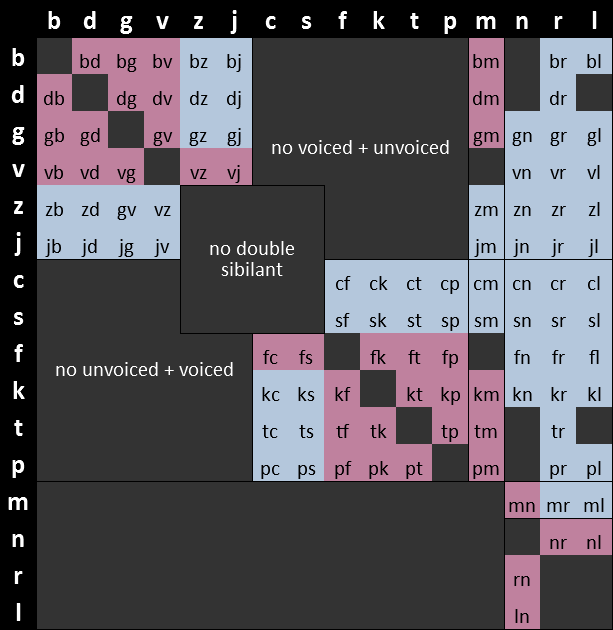

# Morphology

The morphology of eberban is composed of 5 vowels (__a, e, i, o, u__), 16
consonants (__b, c, d, f, g, j, k, l, m, n, p, r, s, t, v, z__) and finally the
letter __h__, for a total of 22 letters. Among the consonants, __n__, __r__ and
__l__ are designated as __sonorants__, and play an important role in eberban's
morphology. No letter can appear 2 times in a row.

Words are usually written separated by spaces, however this is not mandatory.
While removing spaces it might however be required to add a word boundary marker
symbol in some places. This symbol is usually __'__, but others such as __.__
are also accepted.

Letters are chained one after the other without spaces to form __words__ which
are devided in multiple categories based on their structure.

## Word types

### Particles

__Particles__ are words exerting grammatical functions. They starts with a
single _non-sonorant consonant_, followed only by _vowels_ and _h_, like __pa__,
__mio__ or __tiho__. Particles are themselves categorized into __families__
having identical grammar but different meanings.

All other words are __predicate words__ and express intrinsic meanings such as
"cat", "language" or "teach". They are made of the following categories :

### Roots

__Roots__ are the building blocks of the language and express meanings that
would be hard or too long to convey otherwise. They can either :

- start with a single _non-sonorant consonant_ followed by a mix of _vowels_ and
  at least one _sonorant_ or _middle consonant pair_, like __ban__, __mana__,
  __cuina__ or __marne__.
- start with a valid _initial consonant pair_ followed by a mix of _vowels_ and
  any number of _sonorants_ or _middle consonant pairs_ (even none), like
  __bju__, __cpena__ or __djin__.

A _sonorant_ can appear ony between 2 _vowels_ or at the end of the root, while
a middle pair can appear only between 2 _vowels_, but not at the end.

The following chart show __initial pairs__ in blue, __middle pairs__ in red, and
invalid pairs in gray :

### Borrowings

__Borrowings__ allows to import foreign words or names. They are prefixed by the
vowel __u__, and they may contain multiple _non-sonorant consonants_. A maximum
of 3 consonants in a row are allowed, and they can't all be sonorants.
Consonnants are split into 2 categories called __voiced__ (b, d, g, j, v, z) and
__unvoiced__ (c, f, k, p, s, t). A __voiced__ consonnant cannot be followed by
an __unvoiced__ one, and vice-versa. Additionally, __sibilants__ (j, z, s, c)
cannot follow each other.

Borrowings must end with a _vowel_ which can be followed by a single _sonorant_.
In written media borrowings must be followed by either spaces or a word boundary
marker, while in oral speech the penultimate vowel must be stressed. Similarly,
the initial __u__ must be either preceded by spaces or a word boundary marker,
and realized oraly as either a pause or a glotal stop.

Examples with stressed vowel in italics : __udjon*a*tan__, __*u*bar__.

### Assignable names

__Assignable names__ allows to define predicate with a custom name. They follow
the same morphology as _borrowings_ but uses the __a__ prefix instead of __u__.

### Compounds

__Compounds__ allows to make new words from multiple other kind of words. They
start by either __e__, __i__ or __o__ and follow the same rule as the
__u__ of borrowings. Their structure will be detailed later in this book.

### Example

With spaces : _pa za umia tsen eberban_  
Without spaces : _paza'umia'tsen'eberban_

Particles : _pa_, _za_  
Borrowing : _umia_  
Assignable name: _abar_  
Root : _tsen_  
Compound : _eberban_

### Reasoning

Outside of borrowings and assignable names, encountering a _non-sonorant
consonant_ or a word boundary marker means it is the start of a new word; unless
it the first letter of a _middle consonant pair_ which cannot be misunderstood
as the start of a new word. Word boundary markers or spaces before vowel-initial
words allow to prevent them from "merging" into the previous word. The end of
borrowings can easily be recognized with the suffixed space or marker, or stress
in speech.

These simple rules prevent any ambiguity of words boundary, which is called a
__Self-Segregating Morphology__.