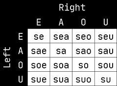

# Explicit switches

## SE prefix

As said in the previous chapter, predicates can have more places than just
__E__ and __A__, such as __van__ :

- van: `(Ed) goes to [Ad] from (Od).`
- spur : `(Ed) is a nest/house/home for [Ad].`
- peol: `(Ed) is a town/city.`

``gloss
mi van spur mo

mi van spur mo

{\[E:$(b) is me\]} {\[E:$(b) goes to A:$(c) from O:$(d)\]}
{\[E:$(c) is a house for A:$(f)\]} {\[E:$(f) is you\]}

I go to a house of yours.
``

We can prefix a predicate with a particle of the family __SE__ (composed of all
particles starting with __s__). The first vowel specifies the place (E, A, O, U)
to chain on the left side, while the second vowel specifies the place to chain
on the right side. If both vowels are the same, they are merged into one vowel
because doubled vowels are not permitted in eberban. This results in the
following table:

``gloss
mi seo van spur mo

mi __seo__ van spur mo

{\[E:$(b) is me\]} {__\<EO\>__}
{\[__E:$(b)__ goes to A:$(c) from __O:$(d)__\]}
{\[E:$(d) is a house for A:$(f)\]} {\[E:$(f) is you\] 〉}

I go from a house of yours.
``

> Non __switch predicates__ thus behave like they were prefixed by __se__,
> while __switch predicates__ behave like they were prefixed by __sea__.

## VE/FE suffix

However, simply chaining predicate words one after the other will not allow
using more than 2 places, with or without __SE__.

Another way to explicitly switch is to use the particle families __VE__, __VEI__
and __FE__.

The __VE__ particle family contains all particles starting with __v__, except
__vei__, which is the only member of family __VEI__. All particles of the __FE__
family starts with __f__.

__VE__ can be used __after__ a predicate word to choose which place to switch
to, and starts what is called a __VE-scope__, which we'll write using
angle brackets `〈 〉` in the glosses.

__ve__ switches to the __E__ place, __va__ to the __A__ place, __vo__ to the
__O__ place and finally __vu__ to the __U__ place.

``gloss
mi van vo spur mo

mi van __vo__ spur mo

{\[E:$(b) is me\]} {\[E:$(d) goes to A:$(c) from __O:$(d)__\]}
{〈 switch to __O:$(d)__} {\[E:$(d) is a house for A:$(f)\]}
{\[E:$(f) is you\] 〉}

I go from a house of yours.
``

However, __VE__ alone is not enough to switch to another place of _van_ later,
as using another __VE__ would switch to a place of the predicate immediately
before it instead. __FE__, on the other hand, will switch to a place of the
_same predicate as the __VE__ that started the current __VE-scope___. Members of
__FE__ are the same as the members of __VE__ but with the __v__ replaced by
__f__.

``gloss
mi van vo spur mo fa peol

mi van __vo__ spur mo __fa__ peol

{\[E:$(b) is me\]} {\[E:$(b) goes to __A:$(c)__ from O:$(d)\]} 
{〈 switch to O:$(d)} {\[E:$(d) is a house for A:$(f)\]}
{\[E:$(f) is you\]} {switch to __A:$(c)__} {\[E:$(c) is a town\] 〉}

I go from a house of yours to the town.
``

The explicit switches will have the same meaning in any order :

``gloss
mi van va peol fo spur mo 

mi van __va__ peol __fo__ spur mo

{\[E:$(b) is me\]} {\[E:$(b) goes to A:$(c) from O:$(d)\]}
{〈 switch to A:$(c)} {\[E:$(c) is a town\]}
{switch to O:$(d)} {\[E:$(d) is a house for A:$(f)\]}
{\[E:$(f) is you\] 〉}

I go to the town from a house of yours.
``

Finally, __VEI__ allows explicitly closing the current __VE-scope__, switching
back to the normal place __individual variable__ explained in the previous
chapter or defined by __SE__.

``gloss
mi van vo spur mo vei peol

mi van __vo__ spur mo __vei__ peol

{\[E:$(b) is me\]} {\[E:$(b) goes to __A:$(c)__ from O:$(d)\]}
{〈 switch to O:$(d)} {\[E:$(d) is a house for A:$(f)\]} {\[E:$(f) is you\]} 〉
{\[__E:$(c)__ is a town\]}

I go from a house of yours to the town.
``

While in simple sentences like this one it is equivalent to using the proper
__FE__, __VEI__ can be necessary when dealing with multiple nested
__VE-scopes__.

> Nested __VE-scopes__ can become a bit overwhelming if they are too long or too
> many. We'll see in a subsequent chapter how to avoid them and keep sentences
> simple.
